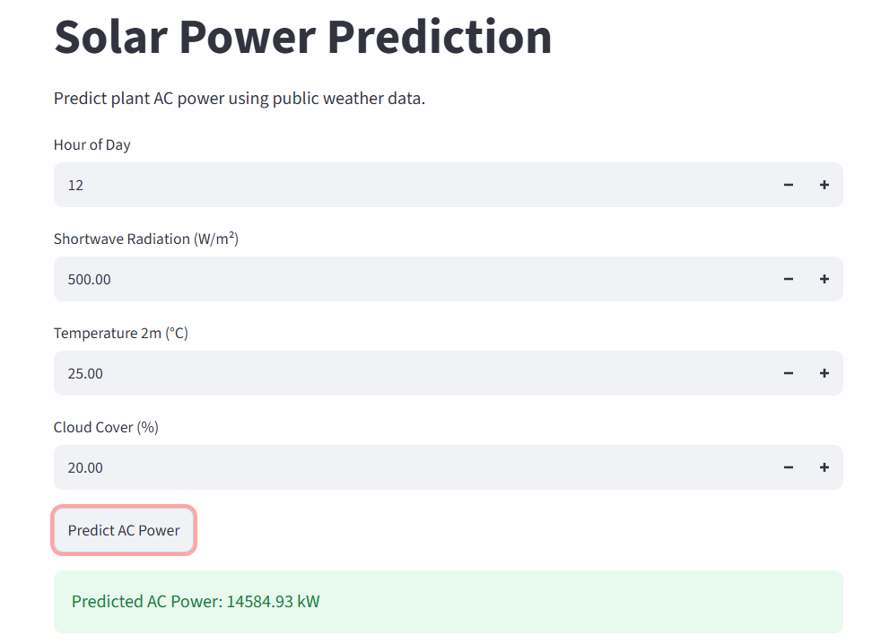

# Predicting Solar Power Plant Output from Weather

## Project Overview

This project implements AML Assignment 1 for Plant 1 of a solar PV power plant.

The main goal is to predict hourly AC power output and compare two feature sets:
- **Set A:** On-site plant sensor measurements.
- **Set B:** Public weather data from Open-Meteo.

Three regression solvers are implemented from scratch using NumPy:
1. Normal Equation
2. Batch Gradient Descent
3. Stochastic Gradient Descent

No scikit-learn, statsmodels, scipy.stats, or other regression/model-fitting libraries are used.

## Repository Structure

```text
data/
    four raw CSV files
    plant1 hourly.csv
    plant1 openmeteo.csv

src/
    load_data.py
    prepare.py
    eda.py
    fetch_weather.py
    regression.py
    train_eval.py

results/
    figures/
    tables/
    saved_weights/
    analysis.md

app/
    app.py

README.md
```

## Requirements

```bash
pip install numpy pandas matplotlib requests
pip install streamlit
```

## How to Run

Run these commands from the project root:

```bash
python src/load_data.py
python src/prepare.py
python src/eda.py
python src/fetch_weather.py
python src/train_eval.py
```

Run the front-end with:

```bash
streamlit run app/app.py
```

## Task 1 – Data Preparation

The two Plant 1 files use different timestamp formats, so the timestamps are parsed separately.

Generation AC and DC power are summed for duplicate timestamps. The generation and sensor data are merged and then resampled hourly.

Current results:
- 3158 generation timestamps after grouping
- 3157 timestamps in both files
- 1 timestamp only in generation
- 25 timestamps only in sensor data
- 816 hourly rows after resampling
- 20 hourly rows with missing values
- 796 final hourly rows
- 0 final rows with missing values

**Note:** 3158 is the timestamp count after grouping, not the raw CSV row count. Raw CSV row counts should be taken from the final Task 1 output/Table 1.

## Task 2 – Exploratory Data Analysis

Four required plots are generated:
1. AC power versus irradiation
2. Module temperature versus ambient temperature
3. AC power versus DC power
4. Average AC power by hour

Figures are saved in `results/figures/`.

## Task 3 – Public Weather Data

Open-Meteo data was downloaded using:
- Latitude: 14.82
- Longitude: 78.28
- Time zone: Asia/Kolkata
- Start: 2020-05-15
- End: 2020-06-17

Variables:
- Shortwave radiation
- Temperature at 2 m
- Cloud cover

Open-Meteo returned 816 hourly rows.

Peak comparison:

| Date | Sensor peak | Open-Meteo peak |
|---|---:|---:|
| 2020-05-15 | 12:00 | 12:00 |
| 2020-05-16 | 12:00 | 12:00 |
| 2020-05-17 | 11:00 | 12:00 |

The maximum shift is 1 hour.

## Task 4 – Regression

Training rows: **628**

Testing rows: **168**

Set A features:
- IRRADIATION
- MODULE_TEMPERATURE
- AMBIENT_TEMPERATURE
- sin_hour
- cos_hour

Set B features:
- sw_radiation
- temp_2m
- cloud_cover
- sin_hour
- cos_hour

Final solver settings:
- Normal Equation: direct solution
- Batch GD: alpha = 0.0001, 50000 iterations
- SGD: alpha = 0.01, 500 epochs

Negative predictions are clipped to zero.

### Test RMSE

| Solver | Features | All hours RMSE (kW) | Daytime RMSE (kW) |
|---|---|---:|---:|
| Normal Equation | Set A | 553.3194 | 723.4147 |
| Batch GD | Set A | 553.3194 | 723.4147 |
| Stochastic GD | Set A | 551.8137 | 722.5999 |
| Normal Equation | Set B | 2626.1292 | 3417.6468 |
| Batch GD | Set B | 2626.1292 | 3417.6468 |
| Stochastic GD | Set B | 2479.7456 | 3141.9844 |

## Task 5 – Analysis

The complete answers for Tasks 5.1–5.5 are in `results/analysis.md`.

Main findings:
- Irradiation has the largest learned feature weight in Set A.
- Set A has much lower daytime RMSE than Set B.
- Batch GD converges essentially to the Normal Equation solution.
- SGD gives similar prediction performance but more variation in learned parameters.
- The largest residual errors occur mainly during daylight hours.

## Task 6 – Front End

The Streamlit application is `app/app.py`.

Saved model files are stored in `results/saved_weights/`.




## Conclusion

For this dataset, the on-site sensor features in Set A provide substantially better prediction accuracy than the public Open-Meteo features in Set B.

Irradiation is the strongest learned feature. The close agreement between Batch GD and the Normal Equation also provides a useful implementation check. SGD is more suitable when the dataset becomes very large because it can update the model incrementally.

